# 🛒 SMART SHOP - E-commerce App

A modern and intuitive Flutter e-commerce application designed to provide a seamless shopping experience. Discover hot deals, trending products, and easily manage your favorite items and cart.

## 🎥 Project Demo

Click the link below to watch a short demo of the Smart Shop app in action!

[▶ Watch the video](https://drive.google.com/file/d/1mXkrhrU-s6kCDJ-GCeqCVR3Jn5u_UUMF/view?usp=sharing)

## ✨ Features

- **Splash Screen**  
  A welcoming first impression for the app.
  
  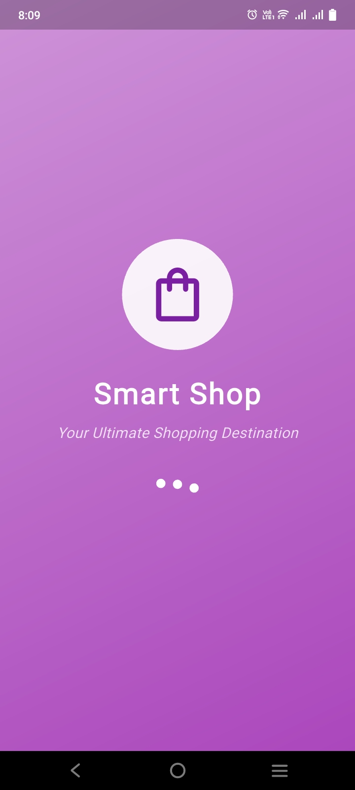

- **Login/ Signup**
  - **Login**: Secure login functionality with dummy data for testing.
    
    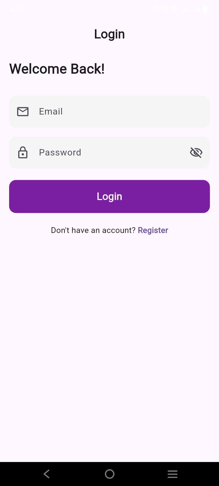

  - **Register Form**: User registration with robust form validation to ensure data integrity.
    
    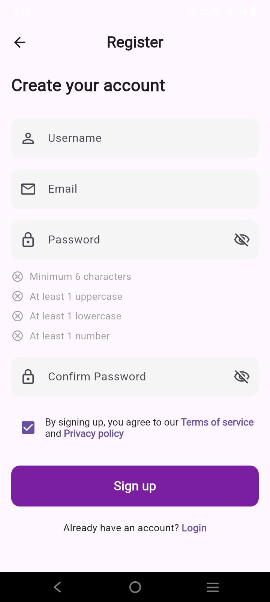

  - **Form Validation**: Demonstrates validation during registration.
    
    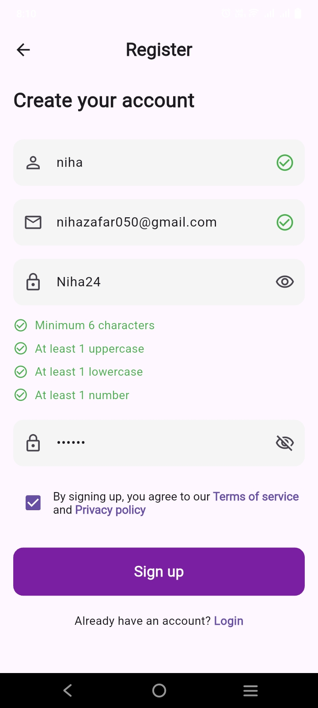

- **Home Page**
  - **Search Functionality**: Easily find products using a dedicated search bar.
  - **Banner Display**: Engaging visual banners for promotions or new arrivals.
  - **Category-wise Filtering**: Browse products efficiently by categories.
  - **Sorting Filters**: Sort products by price (high to low, low to high) and top-rated.
  - **Displaying Products**: Displaying products using fake store api.
  - **Hot Deals Section**: Discover exciting discounts and special offers on popular products.
  - **Trending Products**: Stay updated with the most sought-after and popular items.
  - **Flash Sale Section**: Highlighting limited-time sales for quick purchases.  
    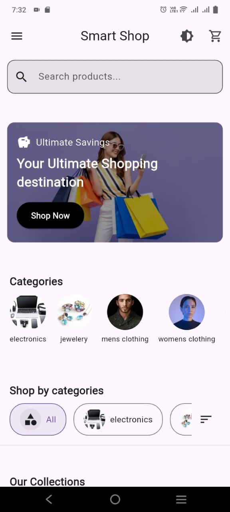
    
    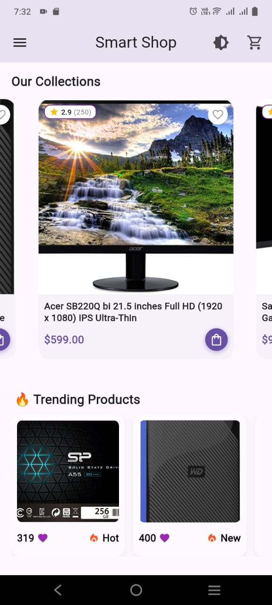  
    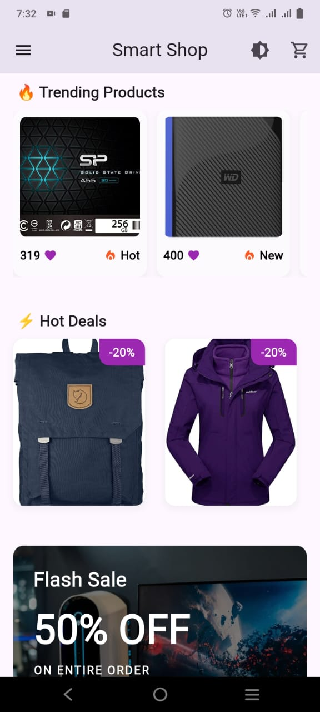  
    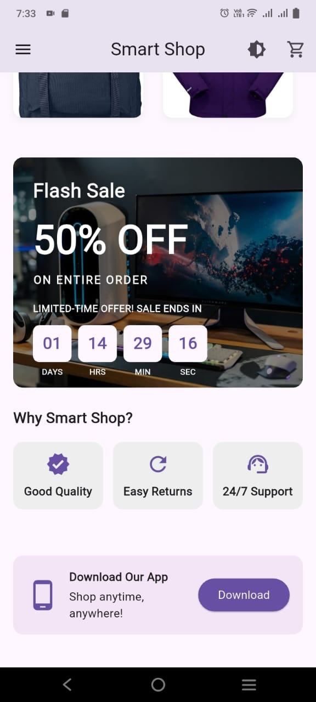

- **Product Details**  
  View comprehensive product information, including prices, image, rating, and descriptions.
    
  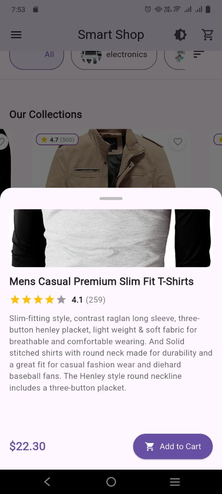

- **Shopping Cart**
  - **Product Display**: Clearly displays added products with their quantities.
  - **Quantity Buttons**: Easily adjust product quantities directly in the cart.
  - **Product delete**: Delete option to remove product from the cart.
  - **Clear Cart**: Option to empty the entire shopping cart with a single tap.
    
    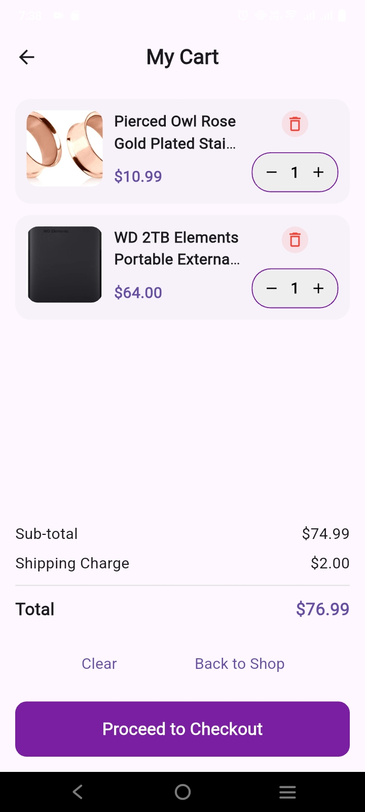

- **Favorites Page**  
  Keep track of your favorite products for quick access later.
  
  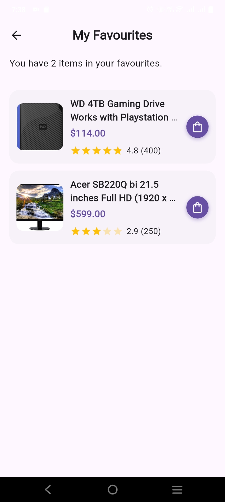

- **User Profile Page**  
  Manage your personal information and preferences.
  
  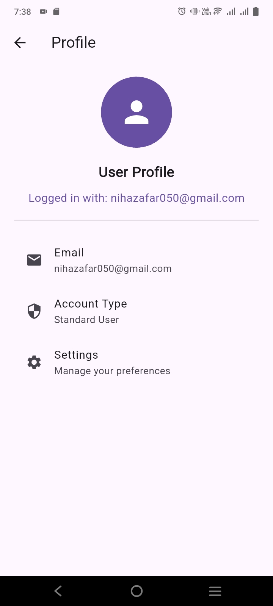

- **Drawer Navigation**  
  A convenient side-drawer for easy access to different app sections.
  
  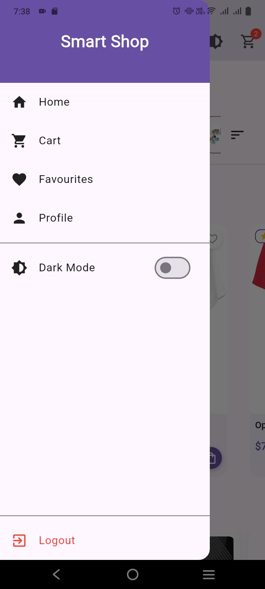

- **Dark/Light Mode**  
  Toggle between dark and light themes for a personalized viewing experience.
  
  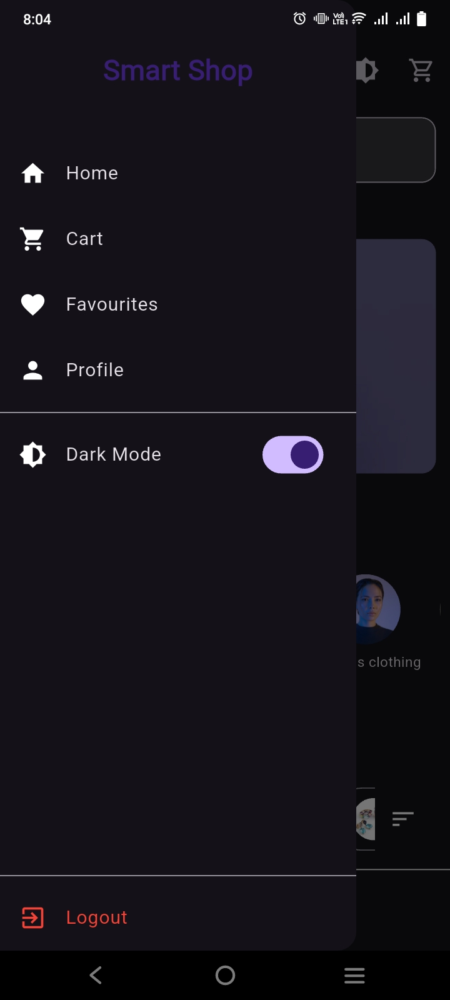
